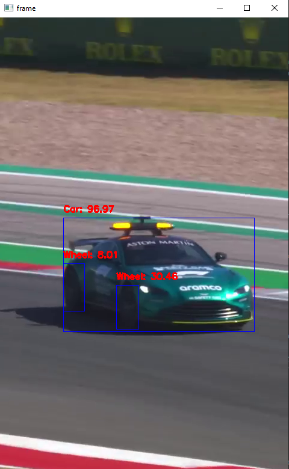

# AWS Rekognition Object Detection

This repo contains the `main.py` and `classification.py` scripts, which use AWS Rekognition to detect objects in a video file. 

## Contents
- [Description](#description)
- [Requirements](#requirements)
- [Usage](#usage)
- [Note](#note)

## Description

- The scripts are used for detecting a specific class of objects in a video file. 
- It uses *AWS Rekognition* to detect objects in each frame of the video. 
- For each detected object, the script draws a *bounding box* around the object in the frame and *labels* it with the object's class and the confidence score. 
- The frame is then displayed.

## Requirements

- Python
- boto3
- opencv

```bash
pip install boto3 opencv-python
```
An AWS account with aceess to AWS Rekognition is also required, and the access keys should be stored in a `credentials.py` file. It should have the following format:

```python
aws_access_key = 'YOUR_ACCESS_KEY'
aws_secret_access_key = 'YOUR_SECRET_KEY'
```

## Usage 

- set the target class of objects to detect in the video, and the path to your video file.
- Run the `classification.py` script with the following command:
```bash
python classification.py
```
This will process a video file and output the detected locations to the `./data/anns` directory.

Here's a screenshot:




## Note
Embedding credentials in source code risks unauthorized access. Ensure not to commit `credentials.py`. Add `credentials.py` to your `.gitignore` file to prevent accidental commits.

